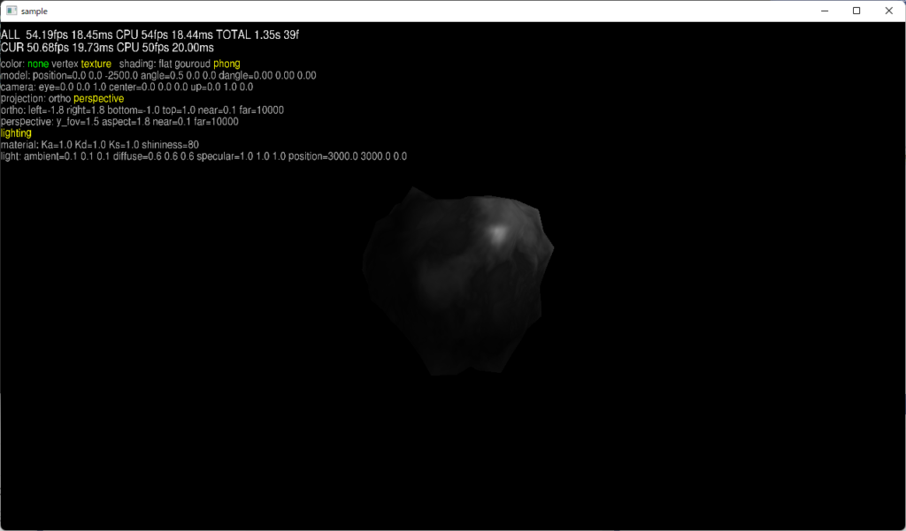

# OpenGL サンプルプログラム

# BLOG

OpenGLサンプル1 - 環境セットアップ  
https://mappuri.com/program/opengl-sample01-settings/  
OpenGLサンプル2 - コード整理  
https://mappuri.com/program/opengl-sample02-refactoring/  
OpenGLサンプル3 - obj ファイル読み込み  
https://mappuri.com/program/opengl-sample03-read_mesh/  
OpenGLサンプル4 - テクスチャーマッピング  
https://mappuri.com/program/opengl-sample04-texture-mapping/  
OpenGLサンプル5 - テキスト描画  
https://mappuri.com/program/opengl-sample05-render_text/  
OpenGLサンプル6 - ライティング  
https://mappuri.com/program/opengl-sample06-lighting/  
OpenGLサンプル7 - フラクタルで地形テクスチャー生成  
https://mappuri.com/program/opengl-sample07-fractal_texture/  
OpenGLサンプル8 - 球体メッシュ生成  
https://mappuri.com/program/opengl-sample08-sphare_mesh/  
OpenGLサンプル9 - 破片データ作成  
https://mappuri.com/program/opengl-sample09-create_fragment/  
OpenGLサンプル  
https://mappuri.com/program/opengl-sample_all/  

----

# OpenGLサンプル1 - 環境セットアップ


プロジェクト、ライブラリのセットアップを行い、サンプルを動かすことを目指します。

## MacOS

### xcode プロジェクト作成

- Create a new Xcode project
  - macOS -> Application -> Command Line Tool -> Next
  - Product Name: opengl_sample, Language: C++, あとは任意で -> Next
    - 任意のフォルダ -> Create
- Project navigator -> 左上の opengl_sample フォルダー 右クリック -> New File...
  - macOS -> C++ File -> Next
  - Name: sample01.cpp, [ ] Also create a header file -> Next
  - こちらのサンプルをコピペ
    - https://www.glfw.org/docs/latest/quick.html

### glfw インストール (macos homebrew でインストールする場合)

homebrew で glfw インストール
```bash
$ brew install glfw
Updating Homebrew...
==> Auto-updated Homebrew!
Updated 2 taps (homebrew/core and homebrew/cask).
==> New Formulae
autorestic                  gcc@10                      imath                       lm-sensors                  nox                         openexr@2                   pgxnclient                  scotch                      sysstat                     virtualenvwrapper
ddcctl                      gtksourceview5              ki                          lsix                        oksh                        openj9                      qodem                       seqkit                      tssh                        xfig
==> Updated Formulae
Updated 751 formulae.
==> Deleted Formulae
aurora-cli
==> New Casks
crescendo                   depthmapx                   ilspy                       irpf2021                    mixed-in-key                pronterface                 sbarex-qlmarkdown           siyuan                      tabtopus                    vitals
cryptonomic-galleon         hancom-word                 invoker                     jellyfin-media-player       mutesync                    recut                       shield                      specter                     usr-sse2-rdm
==> Updated Casks
Updated 609 casks.
==> Deleted Casks
adventure                cliqz                    duckstation              hubic                    meshcommander            netbeans-java-ee         nndd                     revisions                swift-explorer           transmit-disk            wakeonlan
clipbuddy                cuteclips                family-tree-builder      lingo                    netbeans-cpp             netbeans-java-se         printrun                 spideroak-share          tracks-live              vrep

==> Downloading https://ghcr.io/v2/homebrew/core/glfw/manifests/3.3.4
######################################################################## 100.0%
==> Downloading https://ghcr.io/v2/homebrew/core/glfw/blobs/sha256:fb4c73abb6b230ffc2cacf187114584a1e589e67f399b78a56396911b2e1b483
==> Downloading from https://pkg-containers.githubusercontent.com/ghcr1/blobs/sha256:fb4c73abb6b230ffc2cacf187114584a1e589e67f399b78a56396911b2e1b483?se=2021-05-10T04%3A50%3A00Z&sig=5141Scvs8zfctRRmIdyp4zfyxdOL9UbL3KKDGA4Pwm8%3D&sp=r&spr=https&sr=b&sv=2019-12-12
######################################################################## 100.0%
==> Pouring glfw--3.3.4.mojave.bottle.tar.gz
🍺  /usr/local/Cellar/glfw/3.3.4: 14 files, 495KB
```

glfw パス確認
```bash
$ brew info glfw
glfw: stable 3.3.4 (bottled), HEAD
Multi-platform library for OpenGL applications
https://www.glfw.org/
/usr/local/Cellar/glfw/3.3.4 (14 files, 495KB) *
  Poured from bottle on 2021-05-10 at 13:42:10
From: https://github.com/Homebrew/homebrew-core/blob/HEAD/Formula/glfw.rb
License: Zlib
==> Dependencies
Build: cmake ✘
==> Options
--HEAD
    Install HEAD version
==> Analytics
install: 5,218 (30 days), 15,326 (90 days), 40,064 (365 days)
install-on-request: 4,621 (30 days), 13,587 (90 days), 35,883 (365 days)
build-error: 0 (30 days)
```

xcode プロジェクトに glfw パス、ライブラリ追加
- 左上の opengl_sample をクリック
  - Build Settings -> All -> Search Paths -> Header Search Paths -> opengl_sample/glfw/include, non-recursive
  - Build Phases -> Link Binary With Libraries
    - +マーク -> OpenGL.framework -> Add
    - opengl_sample/lib-universal/libglfw.3.dylib をドロップ

### glfw インストール (glfw サイトからヘッダー、ライブラリをダウンロードする場合)

glfw バイナリーダウンロード
- https://www.glfw.org/download.html
  - 64-bit macOS binaries をダウンロード
  - glfw-3.3.4.bin.MACOS.zip を展開して include, lib-universal フォルダを opengl_sample/glfw 配下に移動

xcode プロジェクトに glfw パス、ライブラリ追加
- 左上の opengl_sample をクリック
  - Build Settings -> All -> Search Paths -> Header Search Paths -> opengl_sample/glfw/include, non-recursive
  - Build Phases -> Link Binary With Libraries
    - +マーク -> OpenGL.framework -> Add
    - opengl_sample/lib-universal/libglfw.3.dylib をドロップ

### xcode プロジェクトに glad パス、ファイル追加

- glad ソース生成
  - https://github.com/Dav1dde/glad
  - Glad 2 webservice -> gl Version 4.6, Core -> GENERATE
- glad フォルダをプロジェクト配下にコピー
- インクルードパス追加: opengl_sample/glad/include, non-recursive
- glfw Source package をダウンロードし、dep/linmath.h を opengl_sample 配下にコピー
  - https://www.glfw.org/download.html
- ソースファイル追加: glad/src/glad.c
- ソースファイル修正: sample01.cpp
```c
//#include <glad/gl.h>
#include <glad/glad.h>

    //gladLoadGL(glfwGetProcAddress);
    gladLoadGLLoader((GLADloadproc)glfwGetProcAddress);
```

## Windows

### Visual Studio プロジェクト作成

新しいプロジェクトの作成
- コンソールアプリ > からのプロジェクト > 次へ
- プロジェクト名, ソリューション名: opengl_sample, 場所: C:\Users\matsu\source\repos\opengl_sample\vs -> 作成


### glfw バイナリーダウンロード

新しいプロジェクトの作成
- https://www.glfw.org/download.html
- Source package, 64-bit Windows binaries をダウンロードして展開
- glfw-3.3.7.bin.WIN64 をプロジェクト配下に移動後、include, lib-vc2019 以外のフォルダを消す
- glfw-3.3.7 内の deps/linmath.h をプロジェクト配下に移動


### glad ソース生成

https://github.com/Dav1dde/glad
- Glad 2 webservice -> gl Version 4.6, Core -> GENERATE
- glad.zip をダウンロードして展開し、プロジェクト配下に移動


### プロジェクト設定

- プラットフォームを x64 に変更
- glad\src\glad.c をソースファイルに追加
- ソリューションエクスプローラー -> ソースファイル -> 追加 -> 新しい項目
- c++ ファイル, ファイル名: sample01.cpp -> 追加
- こちらのサンプルをコピペ
  - https://www.glfw.org/docs/latest/quick.html
- 今回 glad を生成したので、コードを一部修正します。
```c:sample01.cpp
//#include <glad/gl.h>
#include <glad/glad.h>

    //gladLoadGL(glfwGetProcAddress);
    gladLoadGLLoader((GLADloadproc)glfwGetProcAddress);
```


- インクルードディレクトリに glad\include, glfw-3.3.7.bin.WIN64\include を追加
- ライブラリに glfw-3.3.7.bin.WIN64\lib-vc2019\glfw3_mt.lib を追加


## 実行結果


----

# OpenGLサンプル2 - コード整理


前回のサンプルのコードを整理していきます。

## 初期化処理

atexit() は標準関数で、プログラム終了時に呼ばれる関数を登録します。登録した関数 atexit_function() 内では、発生したエラー表示と GLFW の終了処理を行っています。

```c++:sample02.cpp
    atexit(atexit_function);
```

## GLFW 初期化

GLFW の初期化を行います。  
glfwSetErrorCallback() で GLFW のエラーが発生したときに呼ばれる関数を登録します。  
OpenGL のバージョンは 4.3 core(Mac は 4.1 core) を指定しています。  

```c++:sample02.cpp
    // GLFW 初期化
    glfwSetErrorCallback(glfw_error_callback); // エラー発生時のコールバック指定
    if (GL_FALSE == glfwInit()) {
        std::cerr << "!glfwInit()" << std::endl;
        return 1;
    }
    glfwWindowHint(GLFW_CONTEXT_VERSION_MAJOR, 4);
#ifdef __APPLE__
    glfwWindowHint(GLFW_CONTEXT_VERSION_MINOR, 1);
#else
    glfwWindowHint(GLFW_CONTEXT_VERSION_MINOR, 3);
#endif
    glfwWindowHint(GLFW_OPENGL_FORWARD_COMPAT, GL_TRUE); // MacOS で必須
    glfwWindowHint(GLFW_OPENGL_PROFILE, GLFW_OPENGL_CORE_PROFILE); // Core Profile
    glfwWindowHint(GLFW_OPENGL_DEBUG_CONTEXT, GL_TRUE); // デバッグモード
    GLFWwindow* const window = glfwCreateWindow(1280, 720, "sample", NULL, NULL); // ウィンドウ作成
    if (nullptr == window) {
        std::cerr << "!glfwCreateWindow()" << std::endl;
        glfwTerminate();
        return 1;
    }
    glfwSetKeyCallback(window, glfw_key_callback); // キーコールバック指定
    glfwMakeContextCurrent(window); // 描画対象
    glfwSwapInterval(1); // バッファ切り替え間隔
```

### OpenGL 初期化

gladLoadGLLoader() で、前回 glad を生成したときに指定したバージョンの OpenGL の関数をロードします。

```c++:sample02.cpp
    // OpenGL 初期化
    if (!gladLoadGLLoader((GLADloadproc)glfwGetProcAddress)) {
        std::cerr << "!gladLoadGLLoader()" << std::endl;
        glfwTerminate();
        return 1;
    }
    // デバッグ出力有効
    if (NULL != glDebugMessageCallback) {
        glEnable(GL_DEBUG_OUTPUT);
        glDebugMessageCallback(gl_debug_message_callback, 0);
    }
    glClearColor(0.0f, 0.0f, 0.0f, 0.0f); // カラーバッファーをクリアする色
    glEnable(GL_DEPTH_TEST); // デプステストを有効にする
    glDepthFunc(GL_LESS); // 前のものよりもカメラに近ければ、フラグメントを受け入れる
    glProvokingVertex(GL_FIRST_VERTEX_CONVENTION); // フラットシェーディング
```

### モデル作成

三角形のモデルを作成します。  

```c++:sample02.cpp
    // モデル作成。
    create_triangle_model(triangle_model);
```

```c++:sample02.cpp
/**
 * triangle
 */
static void create_triangle_model(Model& model) {
    static float vertsf[] = {
         -0.6f, -0.4f, 1.f, 0.f, 0.f ,
          0.6f, -0.4f, 0.f, 1.f, 0.f ,
           0.f,  0.6f, 0.f, 0.f, 1.f
    };
    model.vertsf = vertsf;
    model.verts_count = sizeof(vertsf) / sizeof(Vertex);
    model.verts_stride = sizeof(Vertex);
    model.polys = nullptr;
    model.polys_count = 0;
    create_vertex_buffer(model.vertex_array, model.vertex_buffer, model.element_buffer,
        sizeof(vertsf), vertsf, sizeof(Vertex), 0, nullptr);
}
```

VAO, VBO, EBO を作成するラッパー関数です。

```c++:sample02.cpp
/**
 * メッシュ作成。
 */
static void create_vertex_buffer(
    GLuint& array_buffer, GLuint& vertex_buffer, GLuint& element_buffer,
    GLsizeiptr size, const void* data, GLsizei stride, GLsizeiptr element_size, const void* element_data
) {
    std::cout << "< create_vertex_buffer(): size = " << size << ", element_size = " << element_size << std::endl;

    // VAO(vertex array object) 作成
    glGenVertexArrays(1, &array_buffer);
    assert(0 != array_buffer && "create_vertex_buffer(): glGenVertexArrays(1, &array_buffer);");
    glBindVertexArray(array_buffer);

    // VBO(vertex buffer object) 作成
    glGenBuffers(1, &vertex_buffer);
    assert(0 != vertex_buffer && "create_vertex_buffer(): glGenBuffers(1, &vertex_buffer);");
    glBindBuffer(GL_ARRAY_BUFFER, vertex_buffer);
    glBufferData(GL_ARRAY_BUFFER, size, data, GL_STATIC_DRAW);
    glEnableVertexAttribArray(position_location);
    glVertexAttribPointer(position_location, 2, GL_FLOAT, GL_FALSE, stride, 0);
    glEnableVertexAttribArray(color_location);
    glVertexAttribPointer(color_location, 3, GL_FLOAT, GL_FALSE, stride, (void*)(2 * sizeof(GLfloat)));

    // EBO(element array buffer object) 作成
    if (nullptr != element_data) {
        glGenBuffers(1, &element_buffer);
        assert(0 != element_buffer && "create_vertex_buffer(): glGenBuffers(1, &element_buffer);");
        glBindBuffer(GL_ELEMENT_ARRAY_BUFFER, element_buffer);
        glBufferData(GL_ELEMENT_ARRAY_BUFFER, element_size, element_data, GL_STATIC_DRAW);
    }
}
```

### シェーダー作成

シェーダーを作成し、描画に使用するシェーダーとして指定します。

```c++:sample02.cpp
    // シェーダー作成。
    const GLuint program = glCreateProgram();
    const GLchar* shader_src[] = { vertex_shader_src.c_str(), fragment_shader_src.c_str() };
    create_shader("vertex shader", program, GL_VERTEX_SHADER, shader_src);
    create_shader("fragment shader", program, GL_FRAGMENT_SHADER, shader_src + 1);
    glLinkProgram(program);
    glUseProgram(program);
```

```c++:sample02.cpp
/**
 * シェーダー作成。
 */
static GLuint create_shader(const char* name, const GLuint program, GLenum shaderType, const GLchar** string) {

    // シェーダ―作成
    const GLuint shader = glCreateShader(shaderType);
    glShaderSource(shader, 1, string, NULL);
    glCompileShader(shader);

    // コンパイル結果
    GLint compile_status;
    glGetShaderiv(shader, GL_COMPILE_STATUS, &compile_status);
    if (GL_FALSE == compile_status) {
        std::cerr << "create_shader(): !glCompileShader(): " << name << std::endl;
    }
    GLsizei maxLength, length;
    glGetShaderiv(shader, GL_INFO_LOG_LENGTH, &maxLength);
    if (maxLength > 1) {
        std::vector<GLchar> infoLog(maxLength);
        glGetShaderInfoLog(shader, maxLength, &length, infoLog.data());
        std::cerr << "create_shader(): glGetShaderInfoLog(): " << name << std::endl;
        std::cerr << infoLog.data() << std::endl;
    }
    assert(GL_FALSE != compile_status && "create_shader(): !glCompileShader()");
    if (GL_FALSE == compile_status) {
        exit(1);
    }

    // プログラムオブジェクトにアタッチ
    glAttachShader(program, shader);
    glDeleteShader(shader);
    return shader;
}
```

```c++:sample02.cpp
/** バーテックスシェーダーのソースプログラム。 */
static const std::string vertex_shader_src = R"(
#version 410 core
/**
 * 頂点情報 uniform 構造体定義、現在データ。
 * @see struct vertex_uniform
 */
layout(std140) uniform vertex_uniform {
    mat4 modelview_projection_matrix;
};
layout (location = 0) in vec3 position; // x, y, z: 頂点座標
layout (location = 1) in vec3 color; // r, g, b: 頂点カラー
out vec4 vertex_color; // 頂点カラー

void main() {
    gl_Position = modelview_projection_matrix * vec4(position, 1.0); // 頂点座標
    vertex_color = vec4(color, 1.0);
}
)";

/** フラグメントシェーダーのソースプログラム。 */
static const std::string fragment_shader_src = R"(
#version 410 core
in vec4 vertex_color; // 頂点カラー
out vec4 fragment_color; // 出力ピクセルカラー

void main() {
    // 頂点カラー
    fragment_color = vertex_color;
}
)";
```

### エラー判定

ここまでの初期化処理で、OpenGL のエラーが発生していたらプログラムを終了します。

```c++:sample02.cpp
    // エラー判定
    GLenum error = GL_GET_ERRORS();
    assert(GL_NO_ERROR == error && "main: glGetError();");
    if (GL_NO_ERROR != error) {
        exit(1);
    }
```

### メインループ

ウィンドウが閉じられるまでループ処理を行います。ループ内ではまず描画領域の準備をおこないます。

```c++:sample02.cpp
    // メインループ
    while (GL_FALSE == glfwWindowShouldClose(window)) {
        double time = glfwGetTime();
        int width, height;
        glfwGetFramebufferSize(window, &width, &height);
        glViewport(0, 0, width, height);
        glClear(GL_COLOR_BUFFER_BIT | GL_DEPTH_BUFFER_BIT);
```

### パラメーター計算

モデルの座標計算を行います。

```c++:sample02.cpp
        // パラメーター計算。
        float ratio = (float)width / height;
        calc_params((float)time, ratio);
```

```c++:sample02.cpp
/**
 * パラメーター計算。
 */
static void calc_params(float time, float ratio) {
    // パラメーター変更
    // ビューパラメーター
    ortho.left = -ratio;
    ortho.right = ratio;
    ortho.bottom = -1.0;
    ortho.top = 1.0;
    // モデルパラメーター
    triangle_model.a += triangle_model.va;
    triangle_model.b += triangle_model.vb;
    triangle_model.c += triangle_model.vc;

    // 変換
    mat4x4 model_matrix, view_matrix, projection_matrix;
    // モデル変換
    mat4x4_identity(model_matrix);
    mat4x4_translate(model_matrix, triangle_model.x, triangle_model.y, triangle_model.z);
    mat4x4_rotate_X(model_matrix, model_matrix, triangle_model.a);
    mat4x4_rotate_Y(model_matrix, model_matrix, triangle_model.b);
    mat4x4_rotate_Z(model_matrix, model_matrix, triangle_model.c);
    // ビュー変換
    mat4x4_look_at(view_matrix, camera_eye, camera_center, camera_up);
    // プロジェクション変換
    mat4x4_ortho(projection_matrix, ortho.left, ortho.right, ortho.bottom, ortho.top, ortho.near, ortho.far);
    // MVP
    mat4x4_mul(vertex_uniform.modelview_projection_matrix, projection_matrix, view_matrix);
    mat4x4_mul(vertex_uniform.modelview_projection_matrix, vertex_uniform.modelview_projection_matrix, model_matrix);
}
```

### シェーダー設定

計算した座標を uniform buffer へ転送し、シェーダーに反映させます。

```c++:sample02.cpp
        // シェーダー設定
        glUseProgram(program);
        glBindBuffer(GL_UNIFORM_BUFFER, uniform_buffer);
        GLvoid* buf = glMapBufferRange(GL_UNIFORM_BUFFER, 0, sizeof(vertex_uniform), GL_MAP_WRITE_BIT | GL_MAP_INVALIDATE_BUFFER_BIT);
        memcpy(buf, &vertex_uniform, sizeof(vertex_uniform));
        glUnmapBuffer(GL_UNIFORM_BUFFER);
```

### モデル描画

モデルの描画を行い、バッファを切り替えて画面に反映します。

```c++:sample02.cpp
        // モデル描画
        // 描画
        glBindVertexArray(triangle_model.vertex_array);
        if (0 == triangle_model.element_buffer) {
            glDrawArrays(GL_TRIANGLES, 0, (GLsizei)triangle_model.verts_count);
        }
        else {
            glDrawElements(GL_TRIANGLES, (GLsizei)triangle_model.polys_count, GL_UNSIGNED_INT, NULL);
        }
        // 描画反映
        glfwSwapBuffers(window);
        glfwPollEvents();
```

## エラー処理

### GLFW のエラー処理

GLFW のエラーが発生したときに呼ばれるコールバック関数を登録します。エラー発生時にはエラー情報を表示します。

```c++:sample02.cpp
    // GLFW 初期化
    glfwSetErrorCallback(glfw_error_callback); // エラー発生時のコールバック指定
```

```c++:sample02.cpp
/**
 * GLFW エラーのコールバック。
glfw_error_callback(): 65543: WGL: Driver does not support OpenGL version 5.3
Assertion failed: 0 && "glfw_error_callback()", file C:\USR\src\blog\opengl_sample\vs\opengl_sample\opengl_sample\sample02.cpp, line 159
 */
static void glfw_error_callback(int error, const char* description) {
    std::cerr << "glfw_error_callback(): " << error << ": " << description << std::endl;
    assert(0 && "glfw_error_callback()");
}
```

### OpenGL のエラー処理

初期化終了時とプログラム終了時にエラー判定し、エラーがあった場合はエラー表示して終了します。

```c++:sample02.cpp
    // エラー判定
    GLenum error = GL_GET_ERRORS();
    assert(GL_NO_ERROR == error && "main: glGetError();");
    if (GL_NO_ERROR != error) {
        exit(1);
    }
```

```c++:sample02.cpp
    atexit(atexit_function);
```

```c++:sample02.cpp
/**
 * 終了ハンドラ。
 */
static void atexit_function() {
    GLenum error = GL_GET_ERRORS();
    assert(GL_NO_ERROR == error && "atexit_function(): glGetError();");
    glfwTerminate();
}
```

```c++:sample02.cpp
/**
 * GLエラー出力。
 */
static GLenum gl_get_errors(const char* file, int line, const char* msg = "") {
    if (NULL == glGetError) {
        std::cerr << file << "(" << line << "): " << "gl_get_errors(): NULL == glGetError" << msg << std::endl;
        return 1;
    }
    GLenum error, first_error = GL_NO_ERROR;
    while (GL_NO_ERROR != (error = glGetError())) {
        if (GL_NO_ERROR == first_error) {
            first_error = error;
        }
        std::cerr << file << "(" << line << "): " << "gl_get_errors(): glGetError() = " << msg << error << std::endl;
    }
    return first_error;
}

#define GL_GET_ERRORS(...) gl_get_errors(__FILE__, __LINE__ __VA_ARGS__)
```

## 実行結果


----

# OpenGLサンプル3 - obj ファイル読み込み


obj ファイルからメッシュデータを読み込むように修正します。

サンプルデータ  
cube.obj  
http://www.opengl-tutorial.org/print/  
bunny  
https://www.prinmath.com/csci5229/OBJ/index.html  

## obj ファイルのフォーマット

```
# 頂点座標
# v x座標 y座標 z座標
v 1.000000 -1.000000 -1.000000

# 頂点のテクスチャー座標
# vt x座標 y座標
vt 0.748573 0.750412

# 頂点の法線ベクトル
# vn x座標 y座標 z座標
vn 0.000000 0.000000 -1.000000


# ポリゴンの頂点インデックス
# 三角形のみサポート
# f 頂点1/テクスチャー1/法線1 頂点2/テクスチャー2/法線2 ...
f 5/1/1 1/2/1 4/3/1

# 以降未サポート

# 外部 mtl ファイル
mtllib cube.mtl

# テクスチャーファイル
usemtl Material_ray.png

# スムーズシェーディング
s off
```

## obj ファイル読み込み関数

mesh.hpp, mesh.cpp  
obj ファイルのパスを渡すと、Vertex 構造体の vector に読み込んだ頂点情報を返します。  
面1頂点1 面1頂点2 面1頂点3 面2頂点1 面2頂点2 面1頂点3 ...  
ポリゴンは三角形限定で、rgb には法線ベクトルから計算したダミー値が入ります。  

```c++:mesh.cpp
/** 頂点情報 */
struct Vertex {
    float x, y, z;
    float r, g, b;
    float u, v;
    float nx, ny, nz;
};

/**
 * メッシュ読み込み。
 */
void read_mesh(const char* path, std::vector<Vertex>& vertex_list);
```

sample03.cpp

```c++:sample03.cpp
    static std::vector<Vertex> vertex_list;
    read_mesh("assets/cube.obj", vertex_list);
```

cube.obj

```
# Blender3D v249 OBJ File: untitled.blend
# www.blender3d.org
mtllib cube.mtl
v 1.000000 -1.000000 -1.000000
v 1.000000 -1.000000 1.000000
v -1.000000 -1.000000 1.000000
v -1.000000 -1.000000 -1.000000
v 1.000000 1.000000 -1.000000
v 0.999999 1.000000 1.000001
v -1.000000 1.000000 1.000000
v -1.000000 1.000000 -1.000000
vt 0.748573 0.750412
vt 0.749279 0.501284
vt 0.999110 0.501077
vt 0.999455 0.750380
vt 0.250471 0.500702
vt 0.249682 0.749677
vt 0.001085 0.750380
vt 0.001517 0.499994
vt 0.499422 0.500239
vt 0.500149 0.750166
vt 0.748355 0.998230
vt 0.500193 0.998728
vt 0.498993 0.250415
vt 0.748953 0.250920
vn 0.000000 0.000000 -1.000000
vn -1.000000 -0.000000 -0.000000
vn -0.000000 -0.000000 1.000000
vn -0.000001 0.000000 1.000000
vn 1.000000 -0.000000 0.000000
vn 1.000000 0.000000 0.000001
vn 0.000000 1.000000 -0.000000
vn -0.000000 -1.000000 0.000000
usemtl Material_ray.png
s off
f 5/1/1 1/2/1 4/3/1
f 5/1/1 4/3/1 8/4/1
f 3/5/2 7/6/2 8/7/2
f 3/5/2 8/7/2 4/8/2
f 2/9/3 6/10/3 3/5/3
f 6/10/4 7/6/4 3/5/4
f 1/2/5 5/1/5 2/9/5
f 5/1/6 6/10/6 2/9/6
f 5/1/7 8/11/7 6/10/7
f 8/11/7 7/12/7 6/10/7
f 1/2/8 2/9/8 3/13/8
f 1/2/8 3/13/8 4/14/8
```

出力結果


## プロジェクト設定

xcode では以下のように実行時のカレントディレクトリをプロジェクト配下に変更してください。

- Product > Scheme > Edit scheme > Options > Working Directory > [v] Use custom working directory: $PROJECT_DIR/opengl_sample

## 実行結果


----

# OpenGLサンプル4 - テクスチャーマッピング


画像ファイルを読み込んでテクスチャーを表示するように修正します。

## OpenCV を使用してテクスチャー画像読み込み

こちらで OpenCV の環境設定を行ってください。  
https://mappuri.com/program/opencv-settings/

```c++:sample04.cpp
    // テクスチャーイメージ読み込み。
    read_image("assets/uvmap.png",
        // テクスチャー作成。
        [&](unsigned char* data, int width, int height) {
            model.texture = create_texture(data, width, height); });
```

```c++:image.cpp
/**
 * テクスチャーイメージ読み込み。
 */
void read_image(const char* path, std::function<void(unsigned char* data, int width, int height)> callback) {
    cv::Mat img = cv::imread(path);
    callback(img.data, img.cols, img.rows);
}
```

## テクスチャー作成

```c++:sample04.cpp
/**
 * テクスチャー作成。
 */
static GLuint create_texture(unsigned char* data, int width, int height) {
    GLuint texture;
    glGenTextures(1, &texture);
    glBindTexture(GL_TEXTURE_2D, texture);
    glPixelStorei(GL_UNPACK_ALIGNMENT, 1);
    GLenum format = GL_RGB;
    glTexImage2D(GL_TEXTURE_2D, 0, format, width, height, 0, format, GL_UNSIGNED_BYTE, data);
    glTexParameteri(GL_TEXTURE_2D, GL_TEXTURE_MAG_FILTER, GL_NEAREST);
    glTexParameteri(GL_TEXTURE_2D, GL_TEXTURE_MIN_FILTER, GL_NEAREST);
    return texture;
}
```

## フラグメントシェーダー

```c++:sample04.cpp
#version 410 core
uniform sampler2D fragment_texture; // テクスチャー
in vec2 vertex_texture_uv; // テクスチャーのUVマッピング座標
out vec4 fragment_color; // 出力ピクセルカラー

void main() {
    // 出力ピクセルカラー
    // テクスチャーのカラー
    fragment_color = texture(fragment_texture, vertex_texture_uv);
}
```

## 描画時のテクスチャー設定

```c++:sample04.cpp
        // テクスチャー設定
        glActiveTexture(GL_TEXTURE0);
        glBindTexture(GL_TEXTURE_2D, cube_model.texture);
```

## 実行結果


----

# OpenGLサンプル5 - テキスト描画


画像ファイルを読み込んでテクスチャーを表示するように修正します。

参考サイト  
https://learnopengl.com/In-Practice/Text-Rendering  

## FreeType の環境設定

こちらで FreeType の環境設定を行ってください。  
https://mappuri.com/program/freetype-settings/

## テキスト描画準備

文字イメージセット用のテクスチャーを用意し、各文字のイメージを書き込みます。また、各文字の座標を取得します。  
また、テキスト描画用のバッファ作成します。


```c++:render_text.cpp
/**
 * テキスト描画初期化。
 */
int init_render_text() {
	// 文字イメージセット描画用テクスチャー準備
	glEnable(GL_CULL_FACE);
	glEnable(GL_BLEND);
	glBlendFunc(GL_SRC_ALPHA, GL_ONE_MINUS_SRC_ALPHA);
	// シェーダー作成。
	program = glCreateProgram();
	create_shader("text vertex shader", program, GL_VERTEX_SHADER, &text_vertex_shader);
	create_shader("text fragment shader", program, GL_FRAGMENT_SHADER, &text_fragment_shader);
	glLinkProgram(program);
	glUseProgram(program);
	// 透視設定
	mat4x4 projection;
	mat4x4_ortho(projection, 0.0f, static_cast<float>(SCR_WIDTH), 0.0f, static_cast<float>(SCR_HEIGHT), 1.f, -100.f);
	glUniformMatrix4fv(glGetUniformLocation(program, "projection"), 1, GL_FALSE, (const GLfloat*)projection);
	// テクスチャー作成
	glGenTextures(1, &texture);
	glBindTexture(GL_TEXTURE_2D, texture);
	glPixelStorei(GL_UNPACK_ALIGNMENT, 1); // disable byte-alignment restriction
	glTexImage2D(GL_TEXTURE_2D, 0, GL_RED, ch_width * ch_count, ch_width, 0, GL_RED, GL_UNSIGNED_BYTE, NULL);
	// FreeType 初期化
	FT_Error ft_error;
	ft_error = FT_Init_FreeType(&ft);
	assert(!ft_error && "init_resources: FT_Init_FreeType();");
	std::string font_name = "assets/font/FreeSans.ttf";
	ft_error = FT_New_Face(ft, font_name.c_str(), 0, &face);
	assert(!ft_error && "init_resources: FT_New_Face();");
	FT_Set_Pixel_Sizes(face, 0, ch_width);

	// 文字ごとのイメージ書き込み
	for (unsigned char c = 0; c < ch_count; ++c) {
		ft_error = FT_Load_Char(face, c, FT_LOAD_RENDER);
		if (ft_error) {
			assert(!ft_error && "init_resources: FT_LOAD_RENDER();");
			continue;
		}
		// 文字イメージをテクスチャーに書き込み
		if (face->glyph->bitmap.width > 0) {
			glTexSubImage2D(GL_TEXTURE_2D, 0, c * ch_width, 0, face->glyph->bitmap.width, face->glyph->bitmap.rows,
				GL_RED, GL_UNSIGNED_BYTE, face->glyph->bitmap.buffer);
		}
		// 文字座標取得
		character_textures[c] = {
			face->glyph->bitmap_left, face->glyph->bitmap_top,
			(int)face->glyph->bitmap.width, (int)face->glyph->bitmap.rows,
			(int)face->glyph->advance.x,
		};
	}

	// 文字イメージセット描画終了
	glTexParameteri(GL_TEXTURE_2D, GL_TEXTURE_WRAP_S, GL_CLAMP_TO_EDGE);
	glTexParameteri(GL_TEXTURE_2D, GL_TEXTURE_WRAP_T, GL_CLAMP_TO_EDGE);
	glTexParameteri(GL_TEXTURE_2D, GL_TEXTURE_MIN_FILTER, GL_LINEAR);
	glTexParameteri(GL_TEXTURE_2D, GL_TEXTURE_MAG_FILTER, GL_LINEAR);
	glBindTexture(GL_TEXTURE_2D, 0);
	FT_Done_Face(face);
	FT_Done_FreeType(ft);

	// テキスト描画用バッファ作成
	glGenVertexArrays(1, &vertex_array);
	glGenBuffers(1, &vertex_object);
	glBindVertexArray(vertex_array);
	glBindBuffer(GL_ARRAY_BUFFER, vertex_object);
	glBufferData(GL_ARRAY_BUFFER, sizeof(float) * 6 * 4 * str_length, NULL, GL_DYNAMIC_DRAW);
	glEnableVertexAttribArray(0);
	glVertexAttribPointer(0, 4, GL_FLOAT, GL_FALSE, 4 * sizeof(float), 0);
	glBindBuffer(GL_ARRAY_BUFFER, 0);
	glBindVertexArray(0);
	return 0;
}
```
## テキスト描画

文字イメージセットが描画されたテクスチャーから、各文字のイメージを切り出したポリゴンを作成します。

```c++:render_text.cpp
/**
 * テキスト描画。
 */
float render_text(const char* text, float x, float y, float scale, float color[3], bool proportional) {
	// テキスト描画用バッファ準備
	glUseProgram(program);
	glUniform3f(glGetUniformLocation(program, "texture_color"), color[0], color[1], color[2]);
	glActiveTexture(GL_TEXTURE0);
	glBindVertexArray(vertex_array);

	// テキストポリゴン配列準備
	char* vertices_buf = new char[strlen(text) * 4 * 24];
	int i;
	for (i = 0; i < str_length && '\0' != text[i]; ++i) {
		// テクスチャー切り出し
		character_rectangle_info& ch = character_textures[text[i]];
		float xpos = x + ch.x * scale;
		float ypos = y - (ch.h - ch.y) * scale;
		float w = ch.w * scale;
		float h = ch.h * scale * 1.5f;
		float u = 1.0f / ch_count * text[i];
		float uw = (float)ch.w / ch_width / ch_count;
		float uh = (float)ch.h / ch_width;
		if (!proportional) {
			xpos += (ch_width * scale - w) / 2;
		}
		float vertices[6][4] = {
			{ xpos,     ypos + h, u,      0.0f }, // 0
			{ xpos,     ypos,     u,      uh },
			{ xpos + w, ypos,     u + uw, uh },
			{ xpos,     ypos + h, u,      0.0f }, // 1
			{ xpos + w, ypos,     u + uw, uh },
			{ xpos + w, ypos + h, u + uw, 0.0f },
		};

		// ポリゴン追加
		memcpy(vertices_buf + i * sizeof(vertices), vertices, sizeof(vertices));
		x += proportional ? (ch.advance_x >> 6) * scale : ch_width * scale / 1.5f;
	}

	// ポリゴン描画
	glBindTexture(GL_TEXTURE_2D, texture);
	glBindBuffer(GL_ARRAY_BUFFER, vertex_object);
	glBufferSubData(GL_ARRAY_BUFFER, 0, i * 6ull * 4 * sizeof(float), vertices_buf); // be sure to use glBufferSubData and not glBufferData
	glBindBuffer(GL_ARRAY_BUFFER, 0);
	glDrawArrays(GL_TRIANGLES, 0, 6 * i);
	glBindVertexArray(0);
	glBindTexture(GL_TEXTURE_2D, 0);
	delete[] vertices_buf;
	return x;
}
```

## パネル表示

現在の状態と設定変更ができるパネルを表示します。  
1,2行目は FPS と1フレーム当たりの秒数で、それぞれ平均、平均(CPU 使用率換算)、経過、直近1フレーム、直近1フレーム(CPU 使用率換算)です。  
3行目以降は設定表示で、選択パラメーターは上下左右でカーソル移動し、Enter キーで決定です。数値パラメーターは Enter で赤色にしてから上下左右で数値変更し、再度 Enter キーで決定です。


----

# OpenGLサンプル6 - ライティング


ライティングでフラットシェーディング、グーローシェーディング、フォンシェーディングを行うように修正します。

参考サイト  
Clockworkcoders Tutorials  
https://www.opengl.org/sdk/docs/tutorials/ClockworkCoders/lighting.php  
WebGL - Phong Shading  
http://www.cs.toronto.edu/~jacobson/phong-demo/  

## シェーダー

バーテックスシェーダー・フラグメントシェーダー共通のライティングです。

```c++:sample06.cpp
/** バーテックス・フラグメントシェーダーのライティングソースプログラム。 */

#version 410 core

#define MODE_COLOR_NONE 1
#define MODE_COLOR_VERTEX 2
#define MODE_COLOR_TEXTURE 4
#define MODE_SHADING_FLAT 8
#define MODE_SHADING_GOUROUD 16
#define MODE_SHADING_PHONG 32
#define MODE_LIGHTING 64
#define MODE_PROJECTION_ORTHO 128
#define MODE_PROJECTION_PERSPECTIVE 256

/**
 * uniform block 構造体定義、現在データ。
 * @see struct uniform_block
 */
layout(std140) uniform uniform_block {
    int mode, pad11, pad12, pad13; // rendering mode

    // model view projection matrix
    mat4 modelview_matrix;
    mat4 modelview_normal_matrix; // transpose(inverse(modelview_matrix))
    mat4 modelview_projection_matrix;

    // ライティング情報
    float Ka; // ambient reflection coefficient
    float Kd; // diffuse reflection coefficient
    float Ks; // specular reflection coefficient
    float shininess;
    vec3 ambient_color; float pad21;
    vec3 diffuse_color; float pad22;
    vec3 specular_color; float pad23;
    vec3 light_position;
};

/**
 * ライティング。
 */
vec4 lighting(vec3 vertex_normal, vec3 vertex_position) {
    // Ip = ka*ia + Σlights(kd(L*N)id + ks(R*V)^a*is)
    // ambient
    vec3 ambient = Ka * ambient_color;
    // diffse
    vec3 N = normalize(vertex_normal); // point normal
    vec3 L = normalize(light_position - vertex_position); // point to light direction
    float lambertian = max(dot(N, L), 0.0);
    vec3 diffuse = clamp(Kd * lambertian * diffuse_color, 0.0, 1.0);
    // specular
    vec3 R = reflect(-L, N); // point to light direction
    vec3 V = normalize(-vertex_position); // point to view direction
    vec3 specular = clamp(Ks * pow(max(dot(R, V), 0.0), shininess) * specular_color, 0.0, 1.0);
    return vec4(ambient + diffuse + specular, 1.0);
}
```

フラットシェーディング・グーローシェーディングはライティングをバーテックスシェーダーで行います。

```c++:sample06.cpp
/** バーテックスシェーダーのソースプログラム。 */

/*
 * 頂点情報の location。
 * @see struct Vertex
 * @see vertex_shader_src: layout (location = _location) in ...;
 * @see create_vertex: glEnableVertexAttribArray(_location);
 * @see create_vertex: glVertexAttribPointer(_location, ...);
 */
layout (location = 0) in vec3 position; // x, y, z: 頂点座標
layout (location = 1) in vec3 color; // r, g, b: 頂点カラー
layout (location = 2) in vec2 texture_uv; // u, v: テクスチャーのUVマッピング座標
layout (location = 3) in vec3 normal; // nx, ny, nz: 頂点の法線ベクトル

// バーテックスシェーダーからフラグメントシェーダーへ渡す情報
out vec3 vertex_position; // 頂点座標
out vec3 vertex_normal; // 頂点の法線ベクトル
out vec4 vertex_color; // 頂点カラー
flat out vec4 vertex_color_flat; // フラットシェーディングの頂点カラー
out vec2 vertex_texture_uv; // テクスチャーのUVマッピング座標

void main() {
    gl_Position = modelview_projection_matrix * vec4(position, 1.0); // 頂点座標
    vertex_position = vec3(modelview_matrix * vec4(position, 1.0)); // 頂点座標
    vertex_normal = vec3(modelview_normal_matrix * vec4(normal, 0.0)); // 頂点の法線ベクトル
    vertex_color = vec4(1.0, 1.0, 1.0, 1.0); // 頂点カラー
    // 頂点カラーを使用
    if ((mode & MODE_COLOR_VERTEX) == MODE_COLOR_VERTEX) {
        vertex_color = vec4(color, 1.0);
    }
    // フラットシェーディング・グーローシェーディングはライティングをバーテックスシェーダーで行う
    if ((mode & MODE_LIGHTING) == MODE_LIGHTING
        && (mode & MODE_SHADING_PHONG) != MODE_SHADING_PHONG) {
        vertex_color = lighting(vertex_normal, vertex_position) * vertex_color;
    }
    // フラットシェーディングの頂点カラー
    vertex_color_flat = vertex_color;
    // テクスチャーのUVマッピング座標
    vertex_texture_uv = texture_uv;
}
```

フォンシェーディングはライティングをフラグメントシェーダーで行います。

```c++:sample06.cpp
/** フラグメントシェーダーのソースプログラム。 */

uniform sampler2D fragment_texture; // テクスチャー @see glBindTexture(GL_TEXTURE_2D, ...);

// バーテックスシェーダーからフラグメントシェーダーへ渡す情報
in vec3 vertex_position; // 頂点座標
in vec3 vertex_normal; // 頂点の法線ベクトル
in vec4 vertex_color; // 頂点カラー
flat in vec4 vertex_color_flat; // フラットシェーディングの頂点カラー
in vec2 vertex_texture_uv; // テクスチャーのUVマッピング座標

// 出力データ
out vec4 fragment_color; // 出力ピクセルカラー

void main() {
    // 頂点カラー
    fragment_color = vertex_color;
    // フラットシェーディングの頂点カラー
    if ((mode & MODE_SHADING_FLAT) == MODE_SHADING_FLAT) {
        fragment_color = vertex_color_flat;
    }
    // テクスチャーのカラー
    if ((mode & MODE_COLOR_TEXTURE) == MODE_COLOR_TEXTURE) {
        fragment_color = texture(fragment_texture, vertex_texture_uv) * fragment_color;
    }
    // フォンシェーディングはライティングをフラグメントシェーダーで行う
    if ((mode & MODE_LIGHTING) == MODE_LIGHTING
        && (mode & MODE_SHADING_PHONG) == MODE_SHADING_PHONG) {
        fragment_color = lighting(vertex_normal, vertex_position) * fragment_color;
    }
}
```

## フラットシェーディング


フラットシェーディングを使用するには、初期化時に以下を実行します。

```c++:sample06.cpp
glProvokingVertex(GL_FIRST_VERTEX_CONVENTION); // フラットシェーディング
```

フラットシェーディングのライティングは頂点に対して行うので、バーテックスシェーダーで行います。また、バーテックスシェーダーからフラグメントシェーダーに渡す頂点カラー変数に flat を付けます。

```c++:sample06.cpp
/** バーテックスシェーダーのソースプログラム。 */
// バーテックスシェーダーからフラグメントシェーダーへ渡す情報
flat out vec4 vertex_color_flat; // フラットシェーディングの頂点カラー

void main() {
    // フラットシェーディング・グーローシェーディングはライティングをバーテックスシェーダーで行う
        vertex_color = lighting(vertex_normal, vertex_position) * vertex_color;
    // フラットシェーディングの頂点カラー
    vertex_color_flat = vertex_color;
...

/** フラグメントシェーダーのソースプログラム。 */
// バーテックスシェーダーからフラグメントシェーダーへ渡す情報
flat in vec4 vertex_color_flat; // フラットシェーディングの頂点カラー
// 出力データ
out vec4 fragment_color; // 出力ピクセルカラー

void main() {
    // 頂点カラー
        fragment_color = vertex_color_flat;
...
```

## グーローシェーディング


グーローシェーディングのライティングは頂点に対して行うので、バーテックスシェーダーで行います。

```c++:sample06.cpp
/** バーテックスシェーダーのソースプログラム。 */
// バーテックスシェーダーからフラグメントシェーダーへ渡す情報
out vec4 vertex_color; // 頂点カラー

void main() {
    // フラットシェーディング・グーローシェーディングはライティングをバーテックスシェーダーで行う
        vertex_color = lighting(vertex_normal, vertex_position) * vertex_color;
...

/** フラグメントシェーダーのソースプログラム。 */
// 出力データ
out vec4 fragment_color; // 出力ピクセルカラー

void main() {
    // 頂点カラー
    fragment_color = vertex_color;
...
```

## フォンシェーディング


フォンシェーディングのライティングはピクセルに対して行うので、フラグメントシェーダーで行います。

```c++:sample06.cpp
/** バーテックスシェーダーのソースプログラム。 */
// バーテックスシェーダーからフラグメントシェーダーへ渡す情報
out vec4 vertex_color; // 頂点カラー

void main() {
    vertex_color = vec4(1.0, 1.0, 1.0, 1.0); // 頂点カラー
...

/** フラグメントシェーダーのソースプログラム。 */
// バーテックスシェーダーからフラグメントシェーダーへ渡す情報
in vec4 vertex_color; // 頂点カラー

// 出力データ
out vec4 fragment_color; // 出力ピクセルカラー

void main() {
    // 頂点カラー
    fragment_color = vertex_color;
    // フォンシェーディングはライティングをフラグメントシェーダーで行う
        fragment_color = lighting(vertex_normal, vertex_position) * fragment_color;
```

----

# OpenGLサンプル7 - フラクタルで地形テクスチャー生成


フラクタルの地形画像を生成し、テクスチャーに使用します。

## モデル作成

```c++:sample07.cpp
/**
 * sphere
 */
static void create_sphere_model(Model& model) {
    // メッシュ読み込み。
    static std::vector<Vertex> vertex_list;
    read_mesh("assets/sphere.obj", vertex_list);
    // メッシュ作成。
    model.vertsf = (float*)vertex_list.data();
    model.verts_count = vertex_list.size();
    model.verts_stride = sizeof(Vertex);
    create_vertex_buffer(model.vertex_array, model.vertex_buffer, model.element_buffer,
        model.verts_count * model.verts_stride, model.vertsf, (GLsizei)model.verts_stride,
        0, nullptr);

    // テクスチャー作成
    int bytes_width_bits = 9;
    int colors = 256;
    model.width = model.height = 1 << bytes_width_bits;
    // フラクタルのビットマップ作成。
    srand((unsigned int)time(NULL));
    float* frac1 = create_fractal(bytes_width_bits, 0.8); // 地表
    float* frac2 = create_fractal(bytes_width_bits, 0.6); // 雲
    // パレット作成。
    int color_table[] = {
        0, 0, 0, 0,
        145, 40, 40, 240,
        160, 160, 100, 80,
        180, 20, 120, 0,
        235, 100, 30, 10,
        245, 128, 128, 128,
        256, 255, 255, 254,
    };
    model.palette = create_color_palette(colors, color_table);
    // [0.0f..1.0f] -> [0..colors -1]、テクスチャの合成
    model.pixels = new int[(size_t)model.width * model.height];
    if (nullptr != frac2) {
        for (int i = 0; i < model.width * model.height; ++i) {
            int c = model.palette[(int)(frac1[i] * (colors - 1))];
            // frac2(0.5 .. 1.0] -> frac1[0.0 .. 1.0-c2] + frac2[0.0 .. 1.0]
            float border = 0.5f;
            if (frac2[i] > border) {
                float c2 = (frac2[i] - border) / (1.0f - border);
                float r = (((c >> 16) & 255) * (1.0f - c2)) + (colors - 1) * c2;
                float g = (((c >> 8) & 255) * (1.0f - c2)) + (colors - 1) * c2;
                float b = (((c >> 0) & 255) * (1.0f - c2)) + (colors - 1) * c2;
                c = (255 << 24) | ((int)r << 16) | ((int)g << 8) | (int)b;
            }
            model.pixels[i] = c;
        }
    }
    delete[] frac1;
    delete[] frac2;
    // テクスチャー作成。
    model.texture = create_texture((unsigned char*)model.pixels, model.width, model.height, 4);
}
```


----

# OpenGLサンプル8 - 球体メッシュ生成


球体メッシュを生成できるようにします。

## 球体メッシュ作成

球体を緯度方向と経度方向に分割してポリゴンを作成します。


```c++:sphere_mesh.cpp
/**
 * 球体メッシュ作成。
 */
void create_sphere_mesh(
    int width, int height, int vert_height, int texture_width_bits, int surfaces, const int* texture, const int* palette,
    int div_a0, int div_da, int div_b,
    float*& verts, size_t& verts_count, size_t& verts_stride, int*& polys, size_t& polys_count
) {
    std::cout << "< create_sphere_mesh:unit=" << texture_width_bits << ",width=" << width << ",height=" << height << std::endl;
    clock_t time1 = clock();
    int texture_width = 1 << texture_width_bits;
    int stride = 11;
    //16, 4, 8 * 8
    //verts=36357,p=36357
    //polys=71633,p=71633
    int p, d, a, b, div_a;
    // 頂点バッファを初期化する
    p = surfaces * stride;
    div_a = div_a0;
    for (b = 1; b <= div_b; ++b, div_a += div_da) {
        p += surfaces * stride * div_a; // d = -1,1: color, x, y, z
    }
    verts = new float[p];
    verts_count = p * sizeof(float) / 11;
    p = 0;
    for (d = -1; d < surfaces; d += 2) {
        for (b = 0; b <= div_b; ++b) {
            double y = height / 2.0 * cos(M_PI / 2.0 * b / div_b) * d;
            double r = width / 2.0 * sin(M_PI / 2.0 * b / div_b);
            div_a = (0 == b) ? 1 : div_a0 + (b - 1) * div_da;
            std::cout << div_a << std::endl;
            for (a = 0; a < div_a; ++a) {
                double x = r * cos(2.0 * M_PI * a / div_a);
                double z = r * sin(2.0 * M_PI * a / div_a);
                int texture_u, texture_v;
                int c = get_color_by_celestial_coordinate(
                    texture_width, 2.0 * M_PI * a / div_a, (float)b / div_b, surfaces,
                    texture, texture_u, texture_v);
                double h = 1.0;
                if (palette) {
                    h = 1.0 + (double)c * vert_height / 256.0;
                    c = palette[c];
                }
                verts[p++] = (float)(x * h);
                verts[p++] = (float)(y * h);
                verts[p++] = (float)(z * h);
                verts[p++] = ((c >> 16) & 255) / 255.0f;
                verts[p++] = ((c >> 8) & 255) / 255.0f;
                verts[p++] = ((c >> 0) & 255) / 255.0f;
                verts[p++] = (float)texture_u / texture_width;
                verts[p++] = (float)texture_v / texture_width;
                double len = sqrt(x * x + y * y + z * z);
                verts[p++] = (float)(x / len);
                verts[p++] = (float)(y / len);
                verts[p++] = (float)(z / len);
            }
        }
    }
    std::cout << "verts_count=" << verts_count << ",p=" << p << ",div_a=" << div_a << std::endl;
    // インデックスバッファを初期化する
    p = surfaces * 3 * div_a; // p0, p1, p2[, p0, p2, p1] ...
    div_a = div_a0;
    for (b = 1; b < div_b; ++b, div_a += div_da) {
        p += surfaces * 3 * 2 * div_a; // d = 0,1
    }
    polys = new int[p];
    polys_count = p;
    p = 0;
    int p0, p1 = 0;
    for (d = 0; d < surfaces; ++d) {
        p0 = p1;
        p1 = p0 + 1;
        div_a = div_a0;
        for (a = 0; a < div_a; ++a) {
            polys[p + 0] = p0;
            assert(p + 1 + d < polys_count);
            polys[p + 1 + d] = p1 + a;
            polys[p + 2 - d] = p1 + (a + 1) % div_a;
            p += 3;
        }
        p0 = p1;
        p1 = p0 + div_a;
        for (b = 1; b < div_b; ++b, div_a += div_da) {
            for (a = 0; a < div_a; ++a, ++p0, ++p1) {
                polys[p + 0 + d] = p0;
                polys[p + 1 - d] = p1;
                polys[p + 2] = p1 + 1;
                p += 3;
                polys[p + 0] = p0;
                polys[p + 1 + d] = p1 + 1;
                polys[p + 2 - d] = (div_a - 1 != a) ? p0 + 1 : p0 + 1 - div_a;
                p += 3;
                if (0 == (a + 1) % (div_a / div_da)) {
                    polys[p + 0] = (div_a - 1 != a) ? p0 + 1 : p0 + 1 - div_a;
                    polys[p + 1 + d] = p1 + 1;
                    polys[p + 2 - d] = (div_a - 1 != a) ? p1 + 2 : p0 + 1;
                    p += 3;
                    ++p1;
                }
            }
        }
    }
    verts_stride = stride * sizeof(float);
    std::cout << "polys_count=" << polys_count << ",p=" << p << ",div_a=" << div_a << std::endl;
    std::cout << "> create_sphere_mesh(): time1=" << ((double)time1 / CLOCKS_PER_SEC) << std::endl;
#if 0
    // 結果dump
    float div = 500.0f;
    std::cout << std::fixed;
    for (int i = 0; i < verts_count / 4; ++i) {
        std::cout << "v " << verts[i * 11] / div << " " << verts[i * 11 + 1] / div << " " << verts[i * 11 + 2] / div << std::endl;
    }
    for (int i = 0; i < verts_count / 4; ++i) {
        std::cout << "vt " << verts[i * 11 + 6] << " " << verts[i * 11 + 7] << std::endl;
    }
    for (int i = 0; i < verts_count / 4; ++i) {
        std::cout << "vn " << verts[i * 11 + 8] << " " << verts[i * 11 + 9] << " " << verts[i * 11 + 10] << std::endl;
    }
    for (int i = 0; i < polys_count / 3; ++i) {
        std::cout << "f " << polys[i * 3 + 0] + 1 << "/" << polys[i * 3 + 0] + 1 << "/" << polys[i * 3 + 0] + 1;
        std::cout << " " << polys[i * 3 + 1] + 1 << "/" << polys[i * 3 + 1] + 1 << "/" << polys[i * 3 + 1] + 1;
        std::cout << " " << polys[i * 3 + 2] + 1 << "/" << polys[i * 3 + 2] + 1 << "/" << polys[i * 3 + 2] + 1 << std::endl;
    }
    exit(0);
#endif
}
```

## 極座標からテクスチャーの色・UV座標を取得

北極・南極地点を中心とし、赤道を四辺として座標変換を行い、頂点の色とUV座標を求めます。


```c++:sphere_mesh.cpp
/**
 * 極座標からテクスチャーの色・UV座標を取得。
 * 
 * @param texture_width テクスチャーの解像度
 * @param a 偏角(経度)
 * @param r 動径(緯度)
 * @param surfaces 1:北半球のみ 2:北半球+南半球
 * @param texture_buffer テクスチャーのピクセルデータ
 * @param color_palette テクスチャーのカラーパレット
 * @param ptx テクスチャーのU座標へのマッピング配列
 * @param pty テクスチャーのV座標へのマッピング配列
 * @param p ptx, pty への格納インデックス
 * @return テクスチャーの ARGB
 */
static int get_color_by_celestial_coordinate(
    int texture_width, double a, double r, int surfaces,
    const int* texture_buffer, int& texture_u, int& texture_v) {
    double ra = 1.0;
    if (2 == surfaces) {
        // 円から矩形へ伸張
        ra = fmod(a, M_PI / 2);
        ra = cos(ra < M_PI / 4 ? ra : M_PI / 2 - ra);
    }
    // 極座標から直交座標へ変換
    int x = (int)((r / ra * cos(a) + 1) * texture_width / 2);
    int y = (int)((r / ra * sin(a) + 1) * texture_width / 2);
    // 4点の色を平均
    int color = 0, i;
    for (i = 0; i < 4; ++i) {
        x = std::min(texture_width - 1, (2 == i) ? x + 1 : x);
        y = std::min(texture_width - 1, (3 == i) ? y + 1 : y);
        color += (texture_buffer[x + texture_width * y] >> 2) & 0x003f3f3f;
        if (0 == i) {
            texture_u = x;
            texture_v = y;
        }
    }
    return color;// | (255 << 24);
}
```

## 実行結果


----

# OpenGLサンプル9 - 破片データ作成


モデルに破壊時の破片データを追加します。

## 破片データ作成

モデル作成時に、頂点データから破片データを作成します。

```c++:model.cpp
/**
 * 破片データ作成。
 */
void create_fragment(Model& model) {
    constexpr int cnt_max11 = 100, cnt_max12 = 150, cnt_max21 = 50, cnt_max22 = 100;
    constexpr float vangle = 0.03f, vdistance = 10.0f, vangle2 = 0.03f, vdistance2 = 10.0f;
    size_t vertex_count = model.polys ? model.polys_count : model.verts_count;
    model.fragments1 = new Model::Fragment[vertex_count / 3];
    model.fragments2 = new Model::Fragment[vertex_count];
    memset(model.fragments1, 0, vertex_count / 3 * sizeof(Model::Fragment));
    memset(model.fragments2, 0, vertex_count * sizeof(Model::Fragment));
    model.fragments_count = vertex_count * 2;
    std::cout << "model.verts_count=" << model.verts_count << std::endl;
    std::cout << "> create_fragment(): vertex_count = " << vertex_count << ", model.fragments_count = " << model.fragments_count << std::endl;
    float* new_vertsf = new float[model.fragments_count * model.verts_stride / sizeof(float)];
    memcpy(new_vertsf, model.vertsf, model.verts_count * model.verts_stride);
    // 中心座標用に頂点座標を加算
    for (int i = 0; i < vertex_count; ++i) {
        size_t vi = (model.polys ? model.polys[i] : i) * model.verts_stride / sizeof(float);
        model.fragments1[i / 3].x += model.vertsf[vi + 0] / 3;
        model.fragments1[i / 3].y += model.vertsf[vi + 1] / 3;
        model.fragments1[i / 3].z += model.vertsf[vi + 2] / 3;
        int i2 = i - i % 3 + (i + 2) % 3; // 0-1 1-2 2-0
        model.fragments2[i].x += model.vertsf[vi + 0] / 2;
        model.fragments2[i].y += model.vertsf[vi + 1] / 2;
        model.fragments2[i].z += model.vertsf[vi + 2] / 2;
        model.fragments2[i2].x += model.vertsf[vi + 0] / 2;
        model.fragments2[i2].y += model.vertsf[vi + 1] / 2;
        model.fragments2[i2].z += model.vertsf[vi + 2] / 2;
    }
    // 移動・回転量
    for (int i = 0; i < vertex_count / 3; ++i) {
        vec3_norm(&model.fragments1[i].vx, &model.fragments1[i].x);
        model.fragments1[i].vx += randf(-1.0f, 1.0f) * vdistance;
        model.fragments1[i].vy += randf(-1.0f, 1.0f) * vdistance;
        model.fragments1[i].vz += randf(-1.0f, 1.0f) * vdistance;
        model.fragments1[i].va = randf(-1.0f, 1.0f) * vangle;
        model.fragments1[i].vb = randf(-1.0f, 1.0f) * vangle;
        model.fragments1[i].vc = randf(-1.0f, 1.0f) * vangle;
        model.fragments1[i].cnt = 0;
        model.fragments1[i].cnt_max = (int)randf(cnt_max11, cnt_max12);
    }
    for (int i = 0; i < vertex_count; ++i) {
        vec3_sub(&model.fragments2[i].vx, &model.fragments2[i].x, &model.fragments1[i / 3].x);
        vec3_norm(&model.fragments2[i].vx, &model.fragments2[i].x);
        model.fragments2[i].vx += randf(-1.0f, 1.0f) * vdistance2;
        model.fragments2[i].vy += randf(-1.0f, 1.0f) * vdistance2;
        model.fragments2[i].vz += randf(-1.0f, 1.0f) * vdistance2;
        model.fragments2[i].va = randf(-1.0f, 1.0f) * vangle2;
        model.fragments2[i].vb = randf(-1.0f, 1.0f) * vangle2;
        model.fragments2[i].vc = randf(-1.0f, 1.0f) * vangle2;
        model.fragments2[i].cnt = 0;
        model.fragments2[i].cnt_max = (int)randf(cnt_max21, cnt_max22);
    }
    model.vertsf = new_vertsf;
}
```

## 破片データ初期化

モデル破壊時に、破片データの座標などの初期化を行います。

```c++:model.cpp
/**
 * 破片データ初期化。
 */
void init_fragment(Model& model, float* buf) {
    constexpr int cnt_max11 = 100, cnt_max12 = 150, cnt_max21 = 50, cnt_max22 = 100;
    size_t vertex_count = model.polys ? model.polys_count : model.verts_count;
    // 移動・回転量
    for (int i = 0; i < vertex_count / 3; ++i) {
        model.fragments1[i].cnt = 0;
        model.fragments1[i].cnt_max = (int)randf(cnt_max11, cnt_max12);
    }
    for (int i = 0; i < vertex_count; ++i) {
        model.fragments2[i].cnt = 0;
        model.fragments2[i].cnt_max = (int)randf(cnt_max21, cnt_max22);
    }
    // 初期データ
    model.fragment1_count = model.fragment2_count = 0;
    memcpy(buf, model.vertsf, model.verts_count * model.verts_stride);
}
```

## 破片データ変更

破片の移動は、移動量に応じて頂点データを直接書き換えます。

```c++:model.cpp
/**
 * 破片データ変更。
 */
void translate_vertex(Model& model, float* buf) {
    size_t stride_length = model.verts_stride / sizeof(float);
    size_t vertex_count = model.polys ? model.polys_count : model.verts_count;
    model.fragment1_count = model.fragment2_count = 0;
    float* buf1 = buf;
    float* buf2 = buf + model.fragments_count * stride_length;
    float angle1[3] = { 0.0f, 0.0f, 0.0f }, sin1[3] = { 0.0f, 0.0f, 0.0f }, cos1[3] = { 1.0f, 1.0f, 1.0f };
    float angle2[3] = { 0.0f, 0.0f, 0.0f }, sin2[3] = { 0.0f, 0.0f, 0.0f }, cos2[3] = { 1.0f, 1.0f, 1.0f };
    for (int i = 0; i < vertex_count; ++i) {
        size_t vi = (model.polys ? model.polys[i] : i) * stride_length;
        if (model.fragments1[i / 3].cnt < model.fragments1[i / 3].cnt_max) {
            // 破片1
            translate_fragment_vertex(&model.fragments1[i / 3], nullptr,
                *(Vertex*)buf1, *(Vertex*)&model.vertsf[vi], angle1, sin1, cos1, nullptr, nullptr, nullptr);
            model.fragments1[i / 3].cnt += (2 == i % 3);
            buf1 += stride_length;
            ++model.fragment1_count;
        } else if (model.fragments2[i].cnt < model.fragments2[i].cnt_max) {
            // 破片2
            for (int j = 0; j < 2; ++j) {
                buf2 -= stride_length;
                ++model.fragment2_count;
                size_t i2 = (0 == j) ? i : i - i % 3 + (i + 2) % 3; // 0-1 1-2 2-0
                size_t vi2 = (model.polys ? model.polys[i2] : i2) * stride_length;
                translate_fragment_vertex(&model.fragments2[i], &model.fragments1[i / 3],
                    *(Vertex*)buf2, *(Vertex*)&model.vertsf[vi2], angle2, sin2, cos2, angle1, sin1, cos1);
            }
            model.fragments1[i / 3].cnt += (2 == i % 3);
            ++model.fragments2[i].cnt;
        }
    }
}

/**
 * 破片データ頂点変更。
 */
static void translate_fragment_vertex(Model::Fragment* fragment1, Model::Fragment* fragment2,
    Vertex& dst_vertex, Vertex& src_vertex, float* angle, float* sin, float* cos, float* angle2, float* sin2, float* cos2) {
    translate_vertex(fragment1, &dst_vertex.x, &src_vertex.x, angle, sin, cos);
    if (fragment2) {
        translate_vertex(fragment2, &dst_vertex.x, &dst_vertex.x, angle2, sin2, cos2);
    }
    dst_vertex.r = src_vertex.r;
    dst_vertex.g = src_vertex.g;
    dst_vertex.b = src_vertex.b;
    dst_vertex.u = src_vertex.u;
    dst_vertex.v = src_vertex.v;
    translate_vertex(nullptr, &dst_vertex.nx, &src_vertex.nx, angle, sin, cos);
    if (fragment2) {
        translate_vertex(nullptr, &dst_vertex.nx, &dst_vertex.nx, angle2, sin2, cos2);
    }
}

/**
 * 頂点変更。
 */
static void translate_vertex(Model::Fragment* fragment, float* dst_vertex, float* src_vertex, float* angle, float* sin, float* cos) {
    float x = src_vertex[0];
    float y = src_vertex[1];
    float z = src_vertex[2];
    if (fragment) {
        // オフセット
        x -= fragment->x;
        y -= fragment->y;
        z -= fragment->z;
        // sin/cos 更新
        for (int i = 0; i < 3; ++i) {
            float a = fragment->cnt * (&fragment->va)[i];
            if (angle[i] != a) {
                angle[i] = a;
                sin[i] = sinf(a);
                cos[i] = cosf(a);
            }
        }
    }
    // x軸回転
    float x1 = x;
    float y1 = y * cos[0] - z * sin[0];
    float z1 = y * sin[0] + z * cos[0];
    // y軸回転
    float x2 = x1 * cos[1] + z1 * sin[1];
    float y2 = y1;
    float z2 = -x1 * sin[1] + z1 * cos[1];
    // z軸回転
    dst_vertex[0] = x2 * cos[2] - y2 * sin[2];
    dst_vertex[1] = x2 * sin[2] + y2 * cos[2];
    dst_vertex[2] = z2;
    if (fragment) {
        // オフセット + 移動
        dst_vertex[0] += fragment->x + fragment->vx * fragment->cnt;
        dst_vertex[1] += fragment->y + fragment->vy * fragment->cnt;
        dst_vertex[2] += fragment->z + fragment->vz * fragment->cnt;
    }
}
```

頂点データを変更しているので、バッファーデータも更新します。

```c++:sample09.cpp
        // モデル描画
        // 破片データ更新。
        if (nullptr != sphere_model.fragments1) {
            if (frame_count >= 100) {
                glBindBuffer(GL_ARRAY_BUFFER, sphere_model.vertex_buffer);
                float* buf = (float*)glMapBufferRange(GL_ARRAY_BUFFER, 0, sphere_model.verts_count * sphere_model.verts_stride, GL_MAP_WRITE_BIT);
                translate_vertex(sphere_model, buf);
                glUnmapBuffer(GL_ARRAY_BUFFER);
                glBindBuffer(GL_ARRAY_BUFFER, 0);
            }
        }
```

破片1はポリゴン、破片2はワイヤーで描画します。

```c++:sample09.cpp
        // 描画
        glBindVertexArray(sphere_model.vertex_array);
        if (frame_count >= 100) {
            if (sphere_model.fragment1_count >= 1) {
                glDrawArrays(GL_TRIANGLES, 0, (GLsizei)sphere_model.fragment1_count);
            }
            if (sphere_model.fragment2_count >= 1) {
                glDrawArrays(GL_LINES, (GLint)(sphere_model.fragments_count - sphere_model.fragment2_count), (GLsizei)sphere_model.fragment2_count);
            }
```

## 実行結果




----

# OpenGLサンプル9 - 破片データ作成


今までのサンプルを統合したバージョンです。

## FPS

FPS: 直近の FPS、処理中割合  
AVG: 起動してからの平均 FPS、処理中割合  

## 設定

上下左右でカーソル(緑)移動  
数値変更: エンターで赤色に変更後、上下左右で値変更、再度エンターで決定  


選択変更: 選択したい箇所でエンター


ON/OFF 切り替え: 切り替えたい箇所でエンター


## 設定内容

### model: 表示するモデル


### interval: 画面更新間隔

0: ウェイトなし  
1: 1フレーム間隔更新  
2: ...  

### color: ポリゴンの色

none: なし(白)


vertex: 頂点色


texture: テクスチャー


### shading: シェーディング

flat: フラットシェーディング


gouroud: グーローシェーディング


phong: フォンシェーディング


### model: モデルの座標

position: 位置(x y z)  
angle: 角度(x軸 y軸 z軸)  
dangle: 回転角度(x軸 y軸 z軸)  

### camera: カメラの座標

eye: カメラの位置(x y z)   
center: カメラの向き(x y z)   
up: カメラの上方向の向き(x y z)   

### projection: 投影

ortho: 平行投影


perspective: 透視投影


### ortho: 平行投影

left right bottom top: 投影面の範囲  
near far: z方向のクリッピング範囲  

### perspective: 透視投影

y_fov: 投影面へのy軸方向の視野角  
aspect: 投影面のx-yアスペクト比  
near far: z方向のクリッピング範囲  

### lighting: ライティング

on


off


### material: 物質光

Ka: 環境反射  
Kd: 拡散反射  
Ks: 鏡面反射  
shininess: 鏡面反射指数(0-128)  


### light: ライト

ambient: 環境光  
diffuse: 拡散光  
specular: 鏡面反射光  
position: 光源座標  


